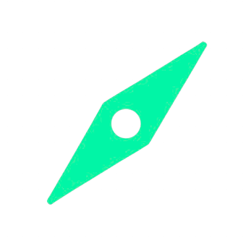
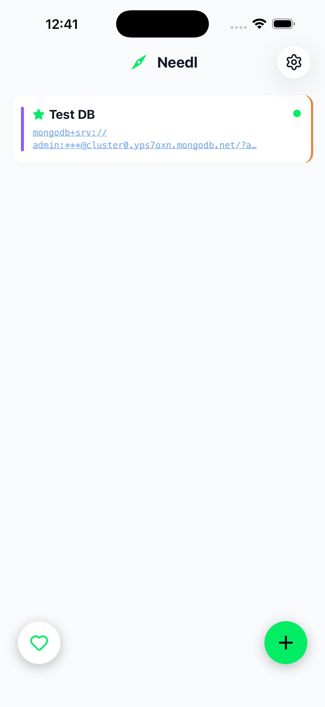
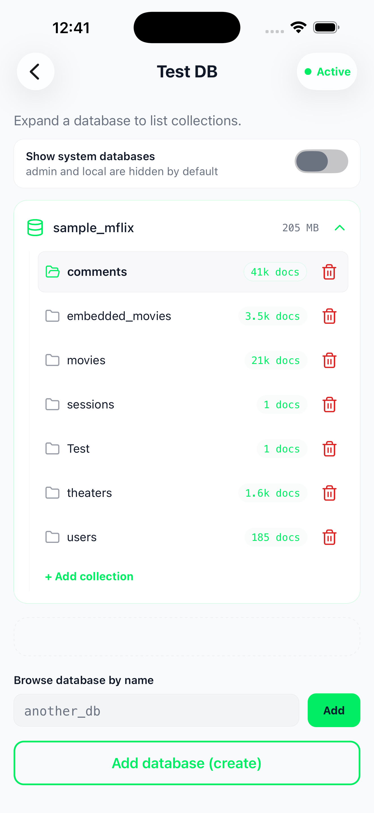
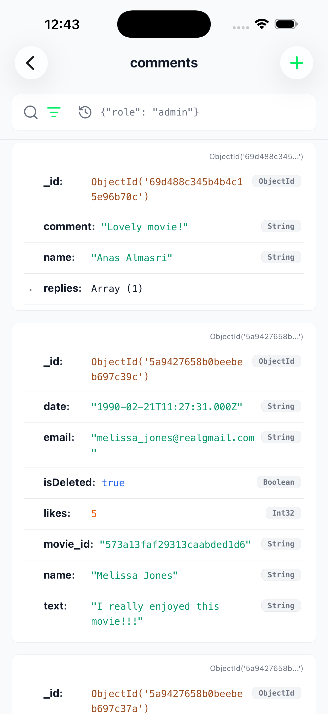
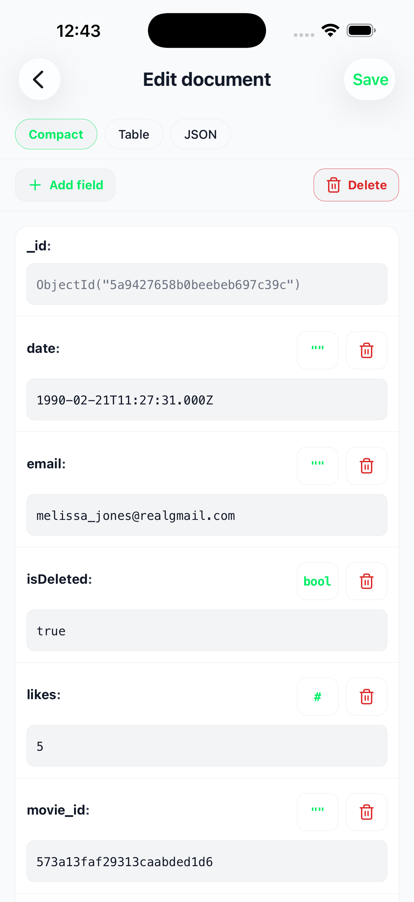
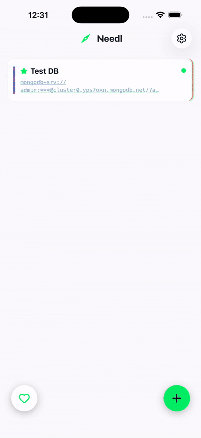

# Needl

<p align="center">
  
</p>

<p align="center">
  <strong>MongoDB Atlas explorer for your phone.</strong><br/>
  Think Compass-style workflows, redesigned for mobile-first speed.
</p>

<p align="center">
  
  
  
  
</p>

---

## What Is Needl?

Needl is a cross-platform MongoDB Atlas explorer built primarily for phone use.
It lets you browse databases/collections, inspect and edit documents, and run filters quickly from a mobile-friendly UI.

If you like MongoDB Compass but wish there was a phone-native experience, Needl is exactly that idea.

---

## Key Capabilities

- Browse Atlas databases and collections from your phone
- Explore documents in **Compact**, **List/Table**, and **JSON** views
- Edit documents in-place with type-aware controls
- Query using JSON filters or plain-text search fallback
- Save and re-use query patterns
- Create documents quickly

---

## Demo & Media

### App Screenshots

<table>
  <tr>
    <td align="center" width="50%">
      <br />
      <sub><b>Home</b> — saved connections</sub>
    </td>
    <td align="center" width="50%">
      <br />
      <sub><b>Collections</b></sub>
    </td>
  </tr>
  <tr>
    <td align="center">
      <br />
      <sub><b>Documents</b></sub>
    </td>
    <td align="center">
      <br />
      <sub><b>Edit</b></sub>
    </td>
  </tr>
</table>

### GIFs / Short Demos

<details>
<summary><b>Query</b> — short demo</summary>
<p align="center">
  
</p>
</details>

<details>
<summary><b>Edit</b> — short demo</summary>
<p align="center">
  
</p>
</details>

<details>
<summary><b>Add</b> — short demo</summary>
<p align="center">
  
</p>
</details>

<!-- ### Video Walkthrough

```md
[Watch the full walkthrough](https://your-demo-link-here)
``` -->

---

## Not Affiliated With MongoDB

Needl is an independent project and is **not affiliated with, endorsed by, or sponsored by MongoDB, Inc.**
MongoDB, MongoDB Atlas, and MongoDB Compass are trademarks of their respective owners.

---

## Documentation

Root README is intentionally product-focused.

For implementation/setup details, use:

- [`frontend/README.md`](frontend/README.md) — app setup, env, running on iOS/Android/web
- [`backend/README.md`](backend/README.md) — API setup, Firebase admin, Stripe/webhooks

---

## Roadmap

- [ ] Better schema-aware search
- [ ] Bulk document operations
- [ ] Team/workspace support

---

<p align="center">
  Built to make Atlas exploration feel native on mobile.
</p>
